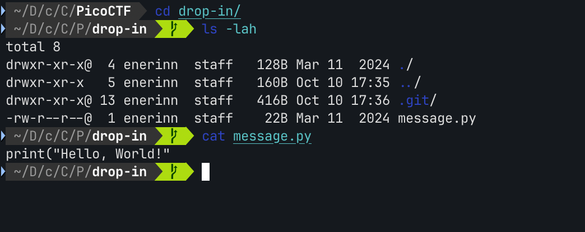

# Blame Game

*Category:* General

---

# Description
> Someone's commits seems to be preventing the program from working. Who is it? You can download the challenge files here:

---

# Attachment

[challenge.zip](./challenge.zip)

---

# Solution

Contains a .git folder and a *message.py*

Tried using `git log` and `git show [commit]` but there was nothing useful.

The `git blame` command shows you who made changes to each line of a file and when. It can help you identify who to consult if you have questions about specific changes.

Using the `git blame message.py`, shows the flag.

