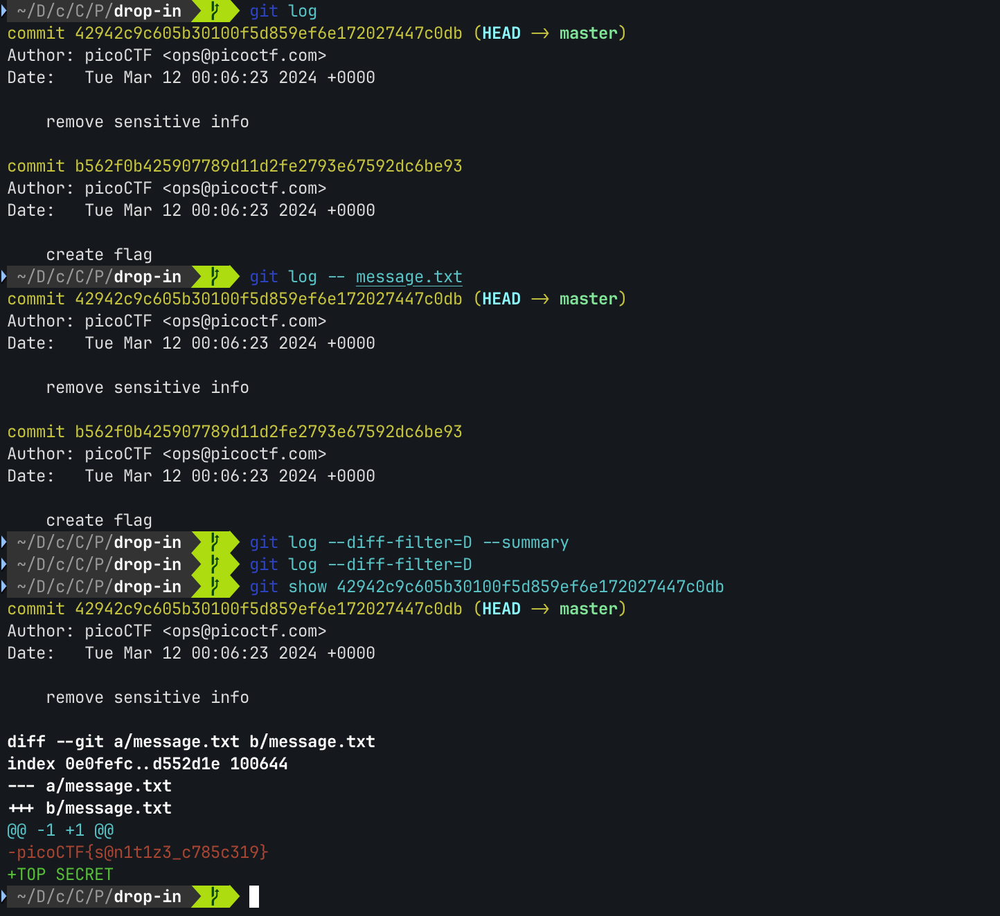

# Commitment Issues

*Category:* General

---

# Description
> I accidentally wrote the flag down. Good thing I deleted it! You download the challenge files here:

---

# Attachment

[challenge.zip](./challenge.zip)

---

# Solution

* Tried git log but didn’t show anything useful.
* Noticed that first commit message was “remove sensitive info”.
* Used `git show [commit hash]` to see the details of the commit.
* One of the commits included the deleted flag.

