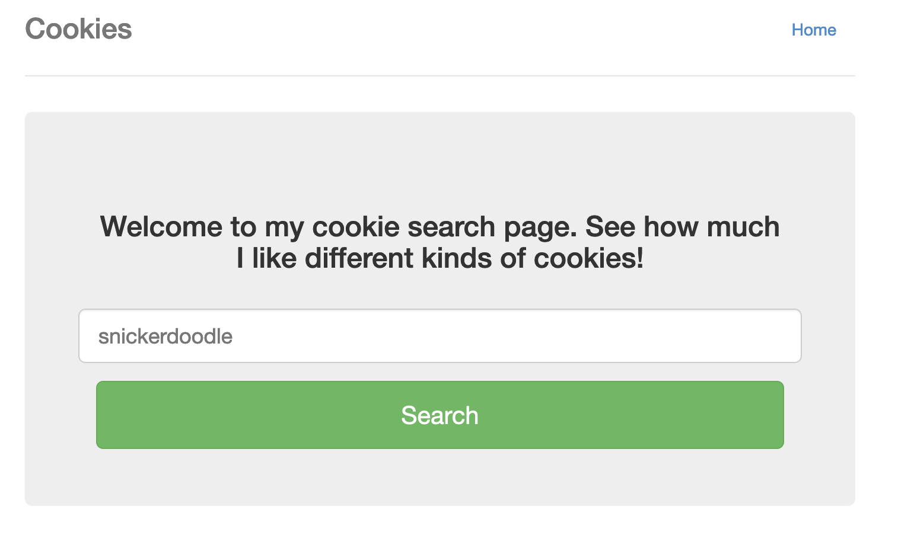
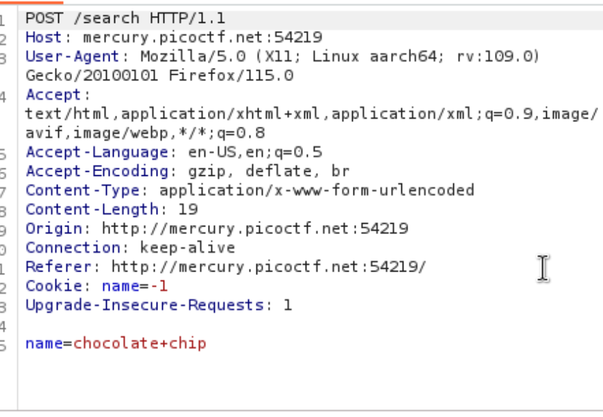

# Cookies

*Category:* Web

---

# Description
> Who doesn't love cookies? Try to figure out the best one.

---

# Attachment

---
# Solution

Looked through html and network tab but didn’t find anything.
Tried brute-forcing by changing the names of the cookies.

Then I noticed “Cookie: name=-1” and brute forced the value of name with different cookie flavors to get the flag.

