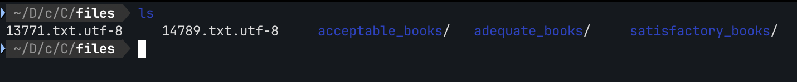

# First Find

*Category:* General

---

# Description
> Unzip this archive and find the file named 'uber-secret.txt'

---

# Attachment

[files.zip](./files.zip)

---
# Solution

Contains these files and folders (each folder contain a series of book text)

Tried using grep but there were no hits.
I found the file with the find command.

