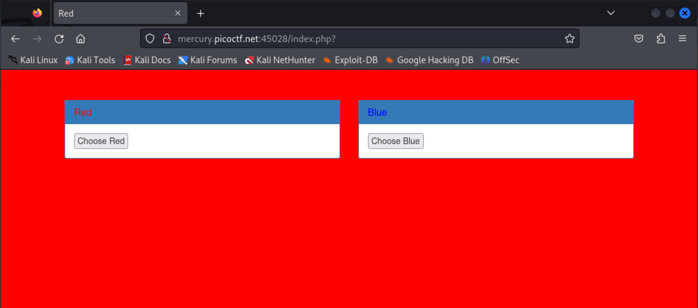
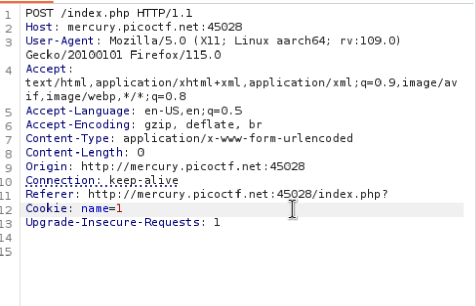
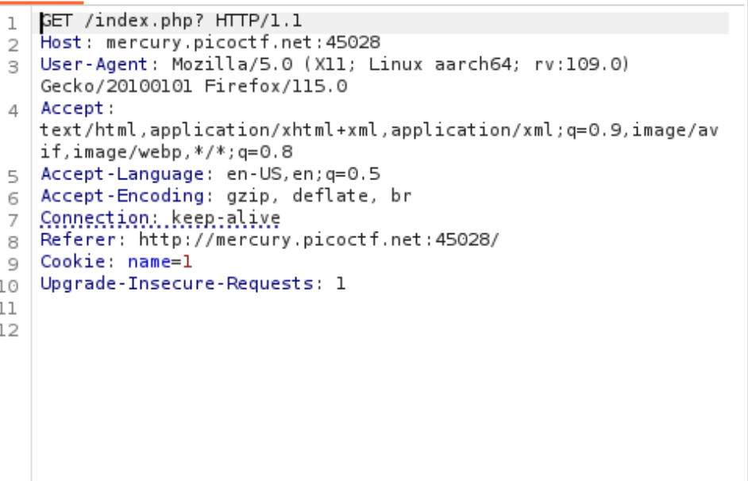

# GET aHEAD

*Category:* Web

---

# Description
> Find the flag being held on this server to get ahead of the competition

---

# Attachment

---
# Solution

The website has buttons that changes the background between red and blue!

Request for red!

Request for blue!

Based on the clue in the title "aHEAD", I changed the GET request to HEAD to get the flag.

