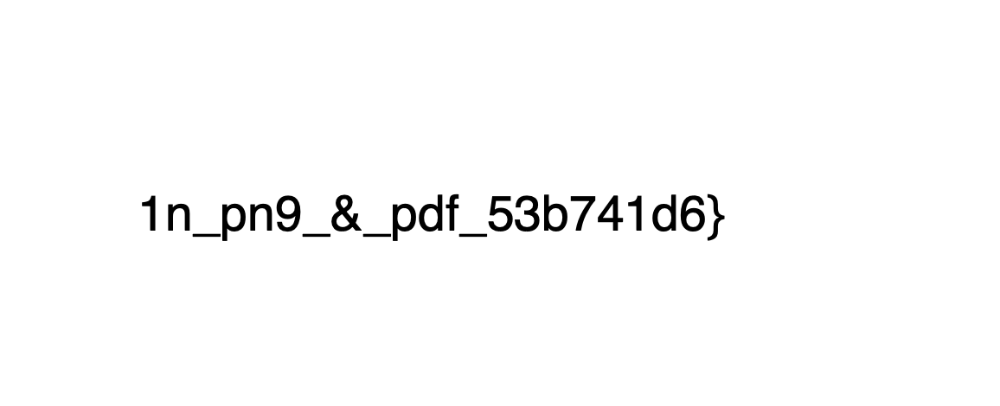
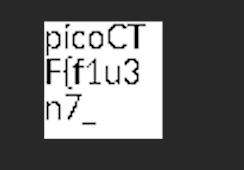

# Secret of the Polyglot

*Category:* Forensics

---

# Description
> The Network Operations Center (NOC) of your local institution picked up a suspicious file, they're getting conflicting information on what type of file it is. They've brought you in as an external expert to examine the file. Can you extract all the information from this strange file?

---

# Attachment

[file](./flag2of2-final.pdf)

---
# Solution

Contains a pdf with part of the flag.

I tried changing the file type since `file` command showed that it was a PNG. In PNG, the image showed the first part of the flag.

