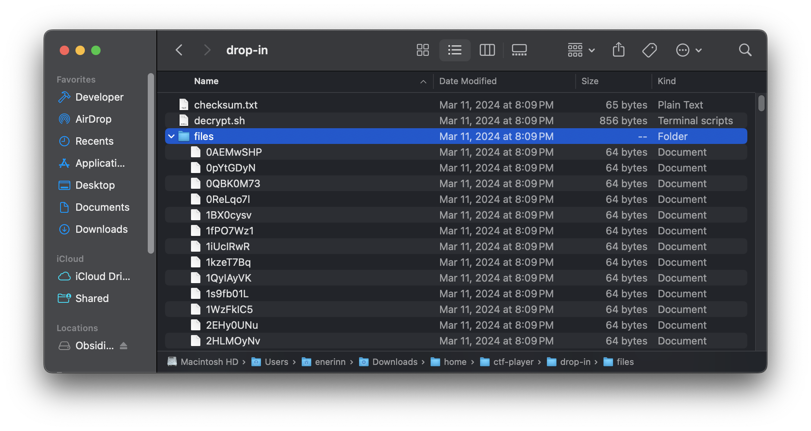
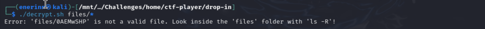
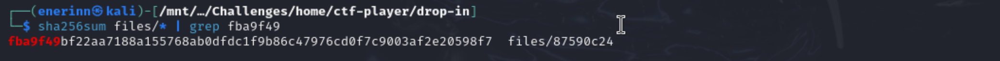

# Verify

*Category:* Forensics

---

# Description
> People keep trying to trick my players with imitation flags. I want to make sure they get the real thing! I'm going to provide the SHA-256 hash and a decrypt script to help you know that my flags are legitimate.

---

# Attachment

---
# Solution

Contains a *challenger.zip* file

with *checksum.txt*, *decrypt script*, and *sha-256 hash files*.

Tried to use decrypt script to decrypt files

Used `sha256sum files/*` to create a checksum of all files.
Passed the output into grep to find the file with the same checksum in checksum.txt.

Used `./decrypt files/87590c24` to get flag
