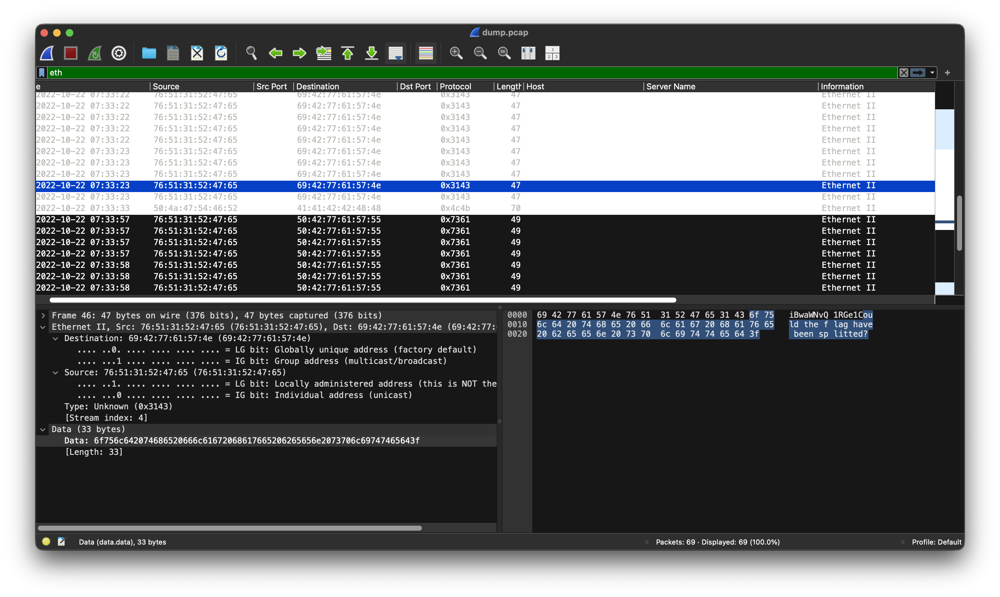
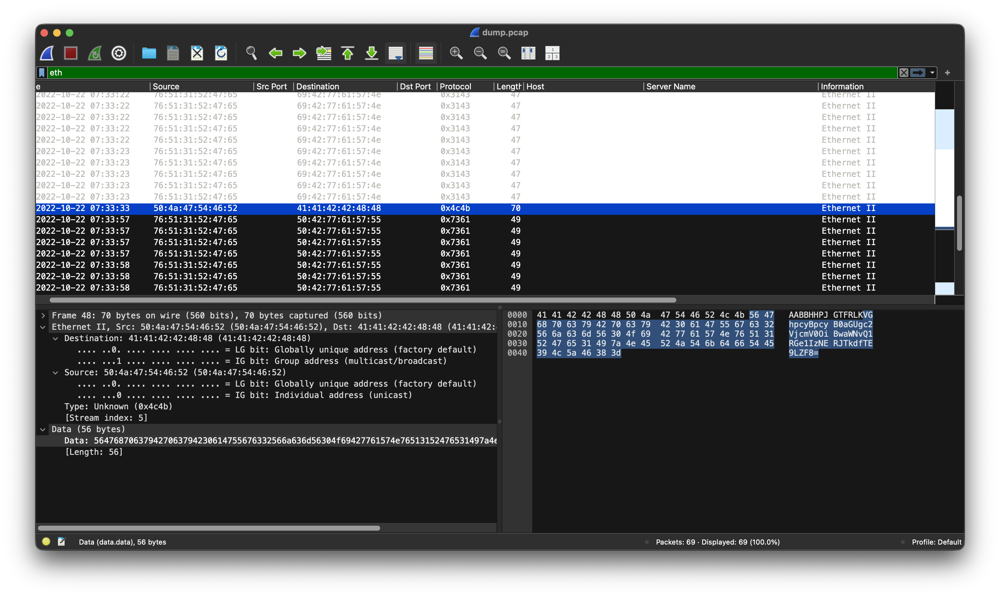

# FindAndOpen

*Category:* Forensics

---

# Description
> Someone might have hidden the password in the trace file. Find the key to unlock this file. This tracefile might be good to analyze.

---

# Attachment

[dump.pcap](./dump.pcap)

[flag.zip](./flag.zip)

---
# Solution

Looking through the pcap, I saw an ethernet packet that hints the flag has been split.

I noticed what looked like the second half of a base64 ciphertext.

Applied the following conversions to ciphertext `564768706379427063794230614755676332566a636d56304f69427761574e76513152476531497a4e45524a546b64665445394c5a46383d` "Data -> From Hex -> From Base64" to get plaintext

`This is the secret: picoCTF{R34DING_LOKd_`

which confirms that the flag was split in half. I assume we get the second half of the flag from the flag file.

I inputted the first flag of the flag as the password for the zip file and got the flag.
