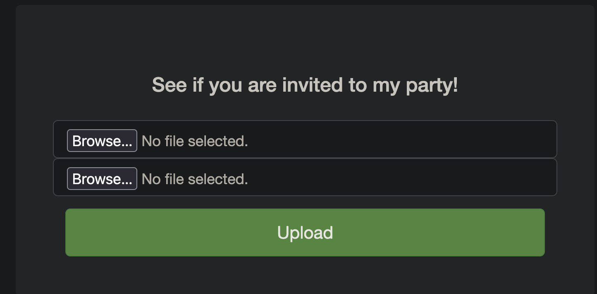
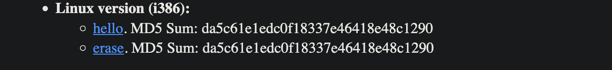

# It is my Birthday

*Category:* Web

---

# Description
> I sent out 2 invitations to all of my friends for my birthday! I'll know if they get stolen because the two invites look similar, and they even have the same md5 hash, but they are slightly different! You wouldn't believe how long it took me to find a collision. Anyway, see if you're invited by submitting 2 PDFs to my website.

---

# Attachment

---
# Solution

We need to upload two pdf files with the same MD5 hash.

This website ([https://www.mscs.dal.ca/~selinger/md5collision/](https://www.mscs.dal.ca/~selinger/md5collision/)) has two files that have the same MD5 hash. Download them and change the extension to pdf and submit to get the flag.

