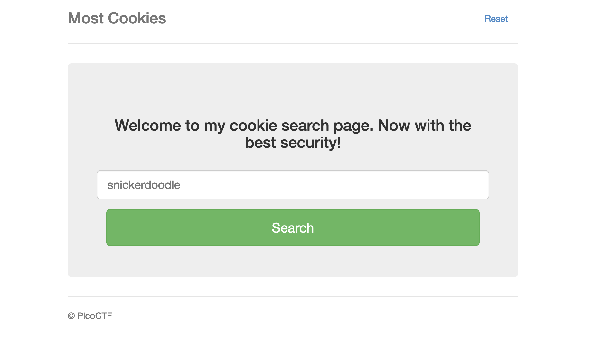
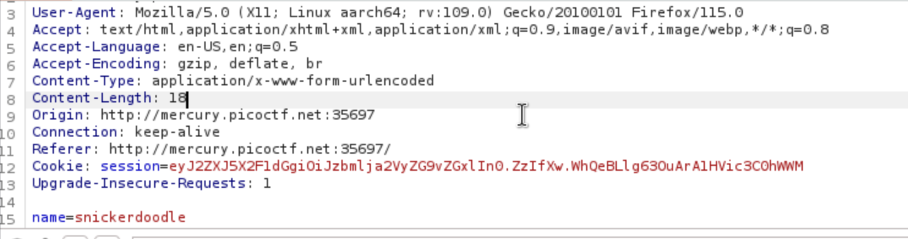
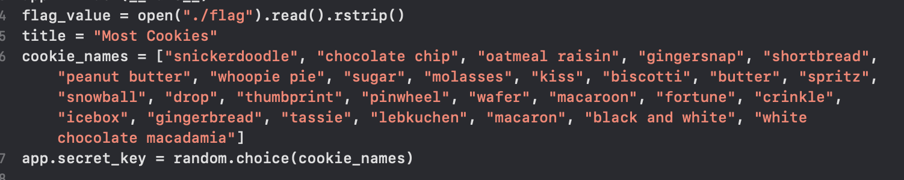
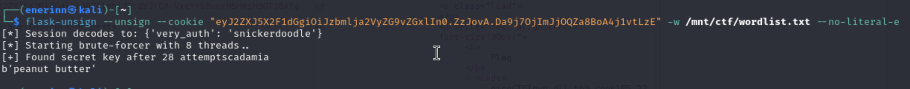
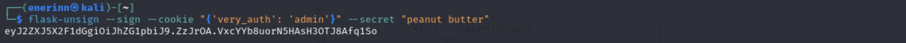
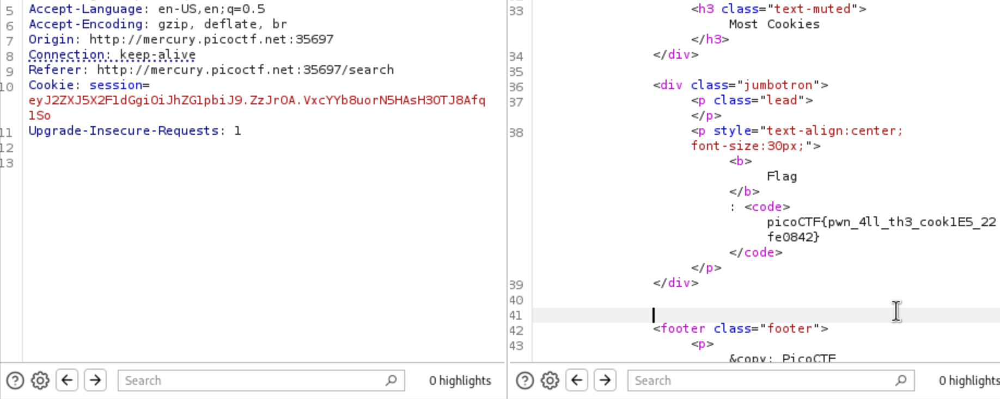

# Most Cookies

# Challenge Name

*Category:* (Forensics / Web / Crypto / Reverse / Pwn / Misc)  

---

# Description
> Paste the challenge description here.

---

# Attachment

---
# Solution

I’m thinking that you need to change the cookie session value.

In the server.py file, it says that the secret key for the cookie will be one of these so we can try to bruteforce the cookie.

I used flask-unsign to perform the bruteforce attack.

I put the modified cookie into Burpsuite and sent it to the server.

