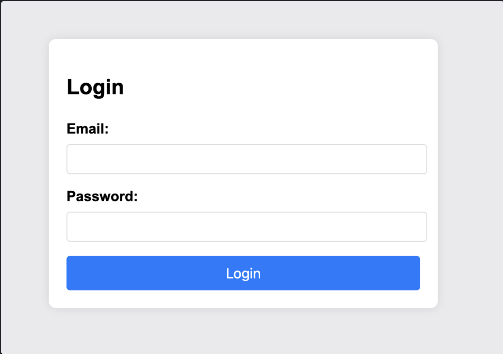
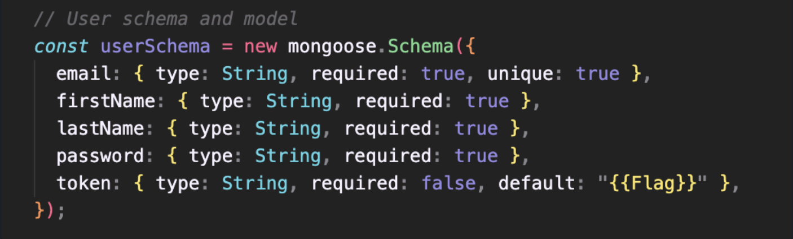
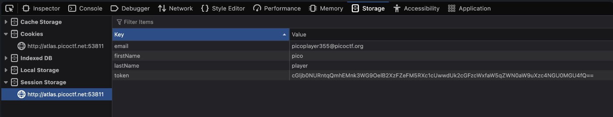
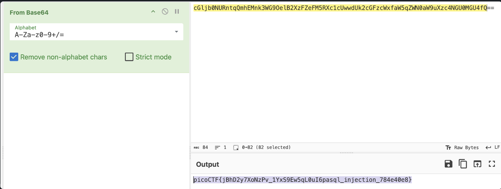

# No Sql Injection

*Category:* Web  

---

# Description
> Can you try to get access to this website to get the flag? You can download the source here.

---

# Attachment

[app.tar.gz](./app.tar.gz)

---

# Solution

There’s a login page, and I assume we are going to use no SQL injection to login.

I used `{ "$ne": null }` on email and password field and was able to get in.

In the code, it shows that the flag is returned in something like a cookie when the user logs in.

In the storage tab of inspect element, I found the token.

Using base64 decryption, I got the flag.

