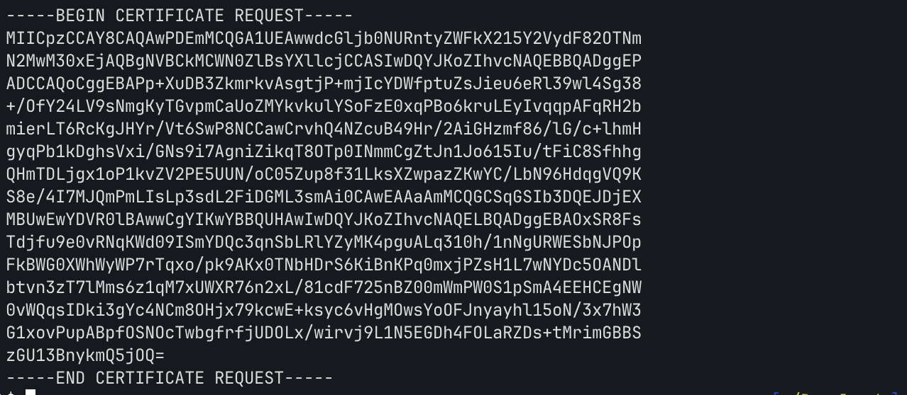

# ReadMyCert

*Category:* Crypto 

---

# Description
> How about we take you on an adventure on exploring certificate signing requests Take a look at this CSR file here.

---

# Attachment

[readmycert.csr](./readmycert.csr)

---
# Solution


Contains a .csr file.



I used the command:

```bash
openssl req -text -in readmycert.csr
```

to find information on the flag.
