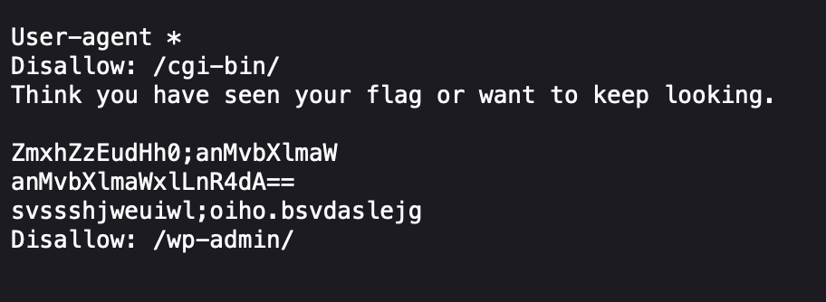

# Roboto Sans

*Category:* Web

---

# Description
> The flag is somewhere on this web application not necessarily on the website. Find it.
---

# Attachment

---
# Solution

I tried to see if the website has a robots.txt file and it did.

I converted the base64 `anMvbXlmaWxlLnR4dA==` and got js/myfile.txt
I put that in the url and got the flag.
