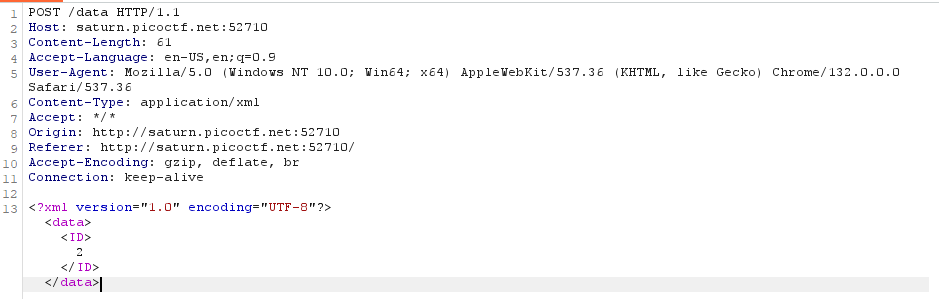
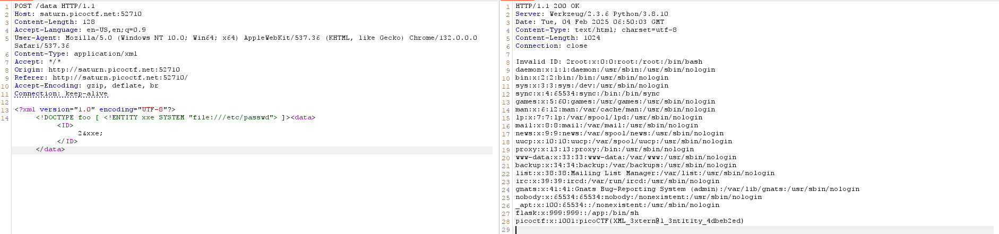

# SOAP

*Category:* Web

---

# Description
> The web project was rushed and no security assessment was done. Can you read the /etc/passwd file?

---

# Attachment

---
# Solution

I noticed that the packet contains xml data.

I modified the xml by adding an xxe payload.

