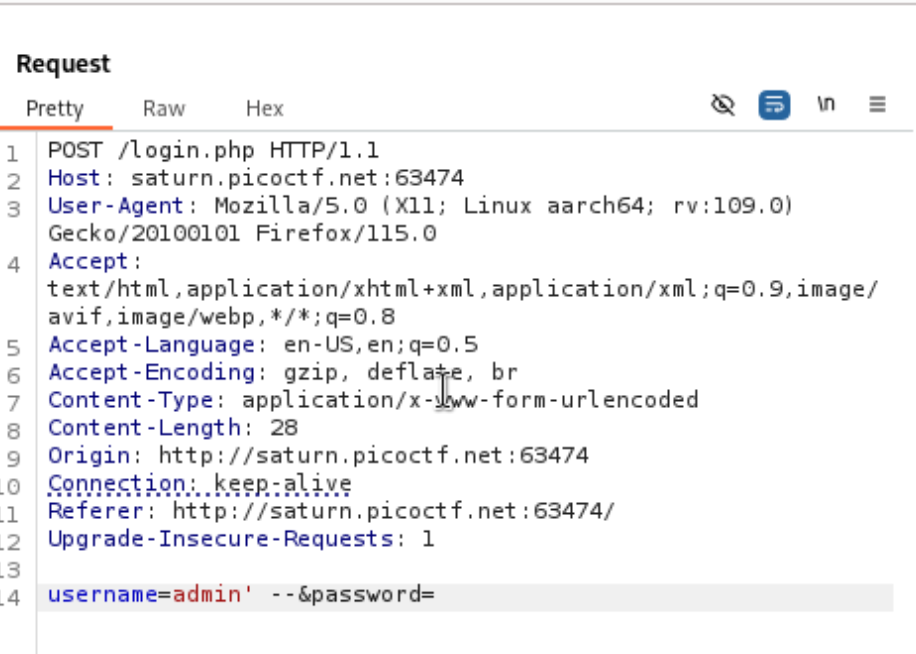

# SQLiLite

*Category:* Web 

---

# Description
> Can you login to this website?

---

# Attachment


---
# Solution

A simple username and password website that has an SQLi vulnerability.

I tried

```bash
' OR 1=1/*
```

on both username and password but it didn’t work.

Then I tried:



and got the flag.
