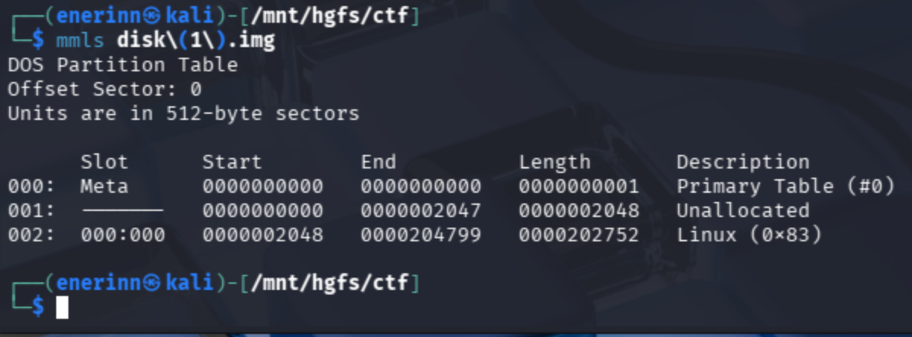

# Sleuthkit Intro

*Category:* Forensics

---

# Description
> Download the disk image and use mmls on it to find the size of the Linux partition. Connect to the remote checker service to check your answer and get the flag. Note: if you are using the webshell, download and extract the disk image into /tmp not your home directory.

---

# Attachment

[disk.img.gz](./disk.img.gz)

---
# Solution

I unzip the file using `gzip -d disk.img.gz` and then used command `mmls` to get the sector length.

I input the length into the terminal and got the flag.