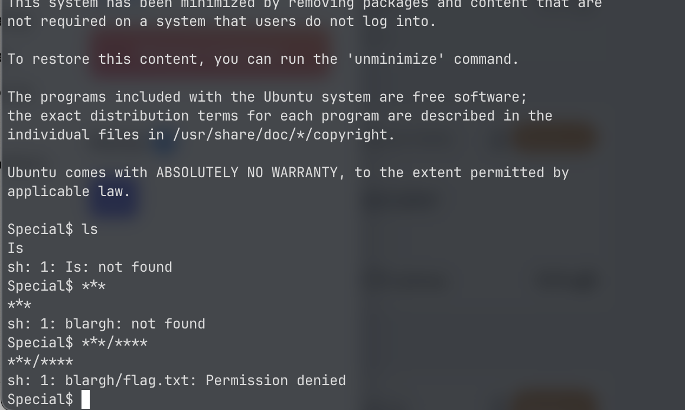
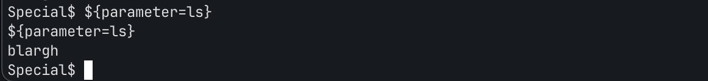

# Special

*Category:* General

---

# Description
> Don't power users get tired of making spelling mistakes in the shell? Not anymore! Enter Special, the Spell Checked Interface for Affecting Linux. Now, every word is properly spelled and capitalized... automatically and behind-the-scenes! Be the first to test Special in beta, and feel free to tell us all about how Special streamlines every development process that you face. When your co-workers see your amazing shell interface, just tell them: That's Special (TM)

---

# Attachment

---
# Solution

The shell capitalizes any command so the commands don’t work. I noticed the flag was in blargh/flag.txt using `***/****`

I saw a write-up saying to use `${parameter='command_here'}`.
This command is used for parameter expansion in shell scripting, which means that it assigns default values to the variable parameter if not already set.

I used `${parameter=cat blargh/flag.txt}` which gave me the flag.