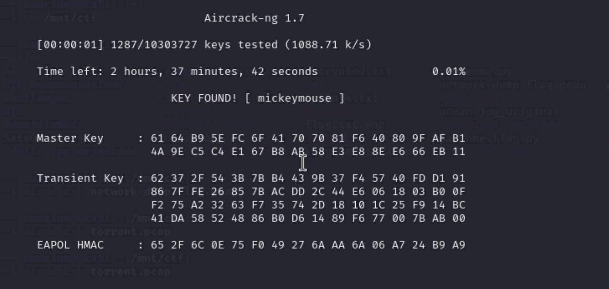

# WPA-ing Out

*Category:* Forensics

---

# Description
> I thought that my password was super-secret, but it turns out that passwords passed over the AIR can be CRACKED, especially if I used the same wireless network password as one in the rockyou.txt credential dump. Use this 'pcap file' and the rockyou wordlist. The flag should be entered in the picoCTF{XXXXXX} format.
---

# Attachment

[pcap](./wpa-ing_out.pcap)

---
# Solution

I opened the pcap with Wireshark but didn’t know how to find the WPA password. I read an [article](https://predatech.co.uk/capturing-and-cracking-wpa-wpa2-wifi-passwords/) about how to crack wpa passwords and it said to use aircrack-ng which aligns with why AIR CRACKED was emphasized in the description.

I used the command `sudo aircrack-ng -w rockyou.txt wpa-ing_out.pcap` to get the cracked password.

